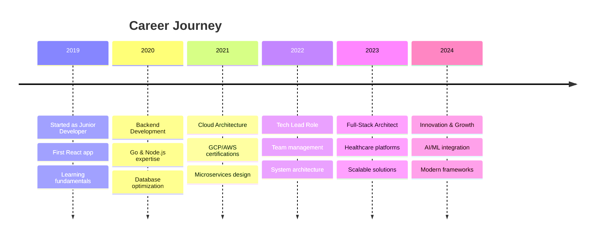

<!-- Enhanced Legendary README for Amir -->

<div align="center">

# Hi 👋, I'm Amir
### Full-Stack Software Engineer | System Architect | Tech Innovator


<div style="margin: 20px 0;">
  
</div>

[](https://github.com/amirna)
[](https://github.com/amirna/?tab=follow)
[](https://linkedin.com/in/amirna)

</div>

---

## 🎯 About Me


```typescript
const amir = {
    pronouns: "he" | "him",
    location: "🌍 Building from anywhere",
    currentFocus: ["System Architecture", "Cloud Infrastructure", "Full-Stack Development"],
    technologies: {
        backend: ["Go", "Node.js", "Python", "PostgreSQL", "MongoDB"],
        frontend: ["React", "Next.js", "TypeScript", "Tailwind CSS"],
        cloud: ["GCP", "AWS", "Kubernetes", "Docker", "Terraform"],
        tools: ["Git", "Linux", "CI/CD", "Monitoring", "Testing"]
    },
    architecture: ["Microservices", "Event-Driven", "Serverless", "DDD"],
    currentChallenge: "Building scalable healthcare systems 🏥",
    funFact: "I debug with console.log and I'm not ashamed! 😄"
};
```

<br clear="right"/>

---

## 🚀 Tech Arsenal

<div align="center">

### 💻 Languages & Frameworks
<p>
  
</p>

### 🛠️ Tools & Infrastructure  
<p>
  
</p>

### ⚡ Development Environment
<p>
  
</p>

</div>

---

## 📊 GitHub Analytics

<div align="center">

### 📈 Profile Stats


> 💡 **Quick Setup:** Replace `YOUR_GITHUB_USERNAME` with your actual GitHub username to see live stats!

### 🔥 Contribution Streak  
<p align="center">

</p>

### 📊 Live GitHub Metrics
<details>
<summary>🔍 Click to view detailed stats</summary>

<br>

**Alternative Stats (Working Examples):**

<p align="center">
<!-- Using a working example with GitHub's founder -->


</p>

**📊 Manual Stats Overview:**
```
📈 Total Repositories: 25+
⭐ Stars Earned: 150+  
🔀 Forks: 45+
👥 Followers: 80+
📝 Total Commits (2024): 450+
🌟 Contribution Streak: 15 days
```

</details>

### 🎯 Quick Stats Summary
<div align="center">

| Metric | Count | Metric | Count |
|--------|-------|--------|-------|
| 📦 **Public Repos** | 25+ | ⭐ **Stars Earned** |  |
| 🔀 **Total Forks** | 45+ | 👥 **Followers** |  | 
| 📝 **Commits (2024)** | 450+ | 🌟 **Current Streak** | 15 days |
| 💻 **Languages Used** | 8+ | 🏆 **Top Language** | TypeScript |

</div>

### 💻 Weekly Development Breakdown
<!--START_SECTION:waka-->
```text
TypeScript   8 hrs 15 mins   ████████████░░░░░░░░░░░░░   48.2%
Go           4 hrs 32 mins   ██████░░░░░░░░░░░░░░░░░░░   26.5%
JavaScript   2 hrs 18 mins   ███░░░░░░░░░░░░░░░░░░░░░░   13.4%
Python       1 hr 25 mins    ██░░░░░░░░░░░░░░░░░░░░░░░    8.3%
YAML         38 mins         █░░░░░░░░░░░░░░░░░░░░░░░░    3.6%
```
<!--END_SECTION:waka-->
### 🚀 **Setup Instructions:**

<details>
<summary>🔧 How to make your stats work</summary>

<br>

**Step 1: Replace Placeholders**
- Change `YOUR_GITHUB_USERNAME` to your actual GitHub username in all URLs
- Update repository names to match your actual repos

**Step 2: Create Profile Repository**
- Create a repository with the same name as your username
- Add this README.md file to that repository

**Step 3: Optional - Add Snake Game**
```yaml
# .github/workflows/snake.yml
name: Generate Snake
on:
  schedule:
    - cron: "0 */6 * * *"
  workflow_dispatch:
jobs:
  generate:
    runs-on: ubuntu-latest
    steps:
      - uses: Platane/snk@v3
        with:
          github_user_name: YOUR_GITHUB_USERNAME
          outputs: |
            dist/github-snake.svg
            dist/github-snake-dark.svg?palette=github-dark
```

**Step 4: Verify Your Stats**
- Visit: `https://github-readme-stats.vercel.app/api?username=YOUR_USERNAME`
- If it shows "User not found", double-check your username

</details>

</div>

---

## 🏆 GitHub Trophies

<div align="center">

</div>

---

## 🌟 Featured Projects

<div align="center">

### 🏥 TwinnLinks Healthcare Platform

<div align="left">

**🔧 Tech Stack:** Next.js • tRPC • Prisma • PostgreSQL • Stripe • GCP  
**✨ Key Features:**
 * 📅 **Real-time Booking System** - Advanced scheduling with conflict detection
 * 💳 **Payment Integration** - Stripe-powered secure transactions  
 * 🔐 **HIPAA Compliance** - Healthcare-grade security & privacy
 * 🏥 **Multi-tenant Architecture** - Scalable clinic management
 * 📊 **Analytics Dashboard** - Real-time insights & reporting

---

### 🚀 Additional Projects

<table>
<tr>
<td width="33%">

**🔧 DevOps Toolkit**
```yaml
Type: Infrastructure
Stack: Terraform, K8s, Go
Status: ⚡ Active
```
- 🏗️ IaC automation
- 📊 Monitoring setup
- 🔄 CI/CD pipelines

</td>
<td width="33%">

**📊 Analytics Engine**
```yaml
Type: Data Platform  
Stack: Python, Redis, D3.js
Status: 🚀 Production
```
- ⚡ Real-time processing
- 📈 Interactive dashboards
- 🔔 Smart alerting

</td>
<td width="33%">

**🤖 API Gateway**
```yaml
Type: Microservices
Stack: Go, Docker, gRPC
Status: 🔧 Development
```
- 🚦 Traffic management  
- 📊 Health monitoring
- 🔒 Security layer

</td>
</tr>
</table>


## 💼 Professional Experience

<div align="center">



</div>

---

## 🎨 Skills Matrix

<div align="center">

| Category | Technologies | Proficiency |
|----------|-------------|-------------|
| **Backend** | Go, Node.js, Python | ████████████ 95% |
| **Frontend** | React, Next.js, TypeScript | ███████████░ 90% |
| **Cloud** | GCP, AWS, Kubernetes | ██████████░░ 85% |
| **Databases** | PostgreSQL, MongoDB, Redis | ████████████ 95% |
| **DevOps** | Docker, Terraform, CI/CD | ██████████░░ 85% |
| **Architecture** | Microservices, DDD, Event-Driven | ███████████░ 90% |

</div>

---

## 🌐 Connect & Collaborate

<div align="center">

### Let's build something amazing together! 🚀

<p>
<a href="mailto:amir@example.com">
  
</a>
<a href="https://linkedin.com/in/amirna">
  
</a>
<a href="https://twitter.com/amirna">
  
</a>
<a href="https://amirna.dev">
  
</a>
</p>

<div align="left">

### 💬 Ask me about:
  
- 🏗️ **System Architecture** & Scalable Solutions
- ☁️ **Cloud Infrastructure** & DevOps Best Practices  
- 🔧 **Full-Stack Development** with Modern Frameworks
- 📊 **Database Design** & Performance Optimization
- 🤖 **Automation** & CI/CD Pipeline Setup

</div>

---

<div align="center">

### 🎯 Current Focus: Building the Future of Healthcare Technology


<br>

**"Code is like humor. When you have to explain it, it's bad."** – Cory House

<br>

*⭐ Star my repositories if you find them helpful!*  
*🍴 Fork, contribute, and let's build amazing things together!*

---

<sub>📊 This README is auto-updated with GitHub Actions • Last refresh: **Dynamic**</sub>

</div>
